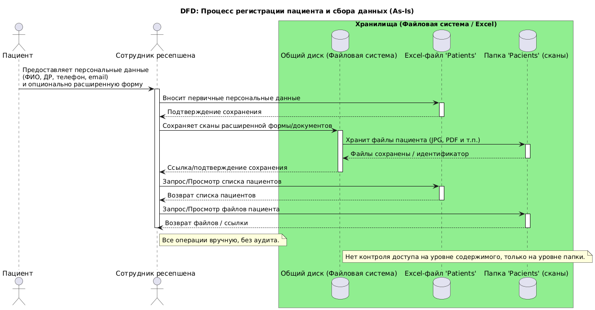
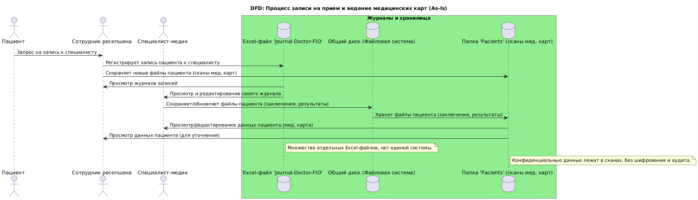
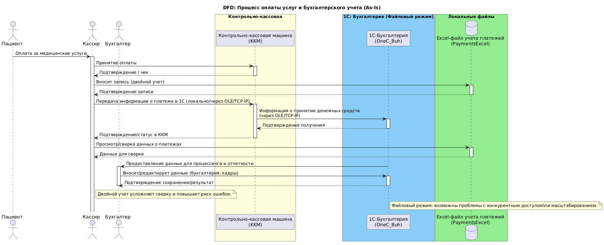
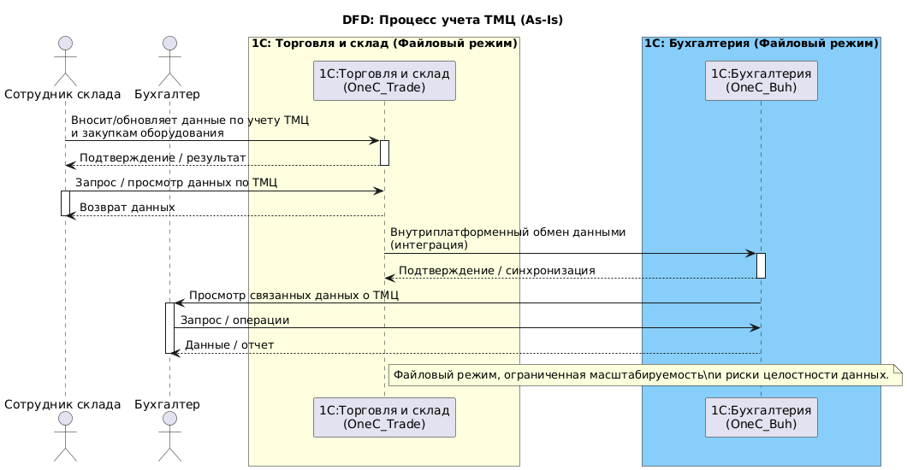
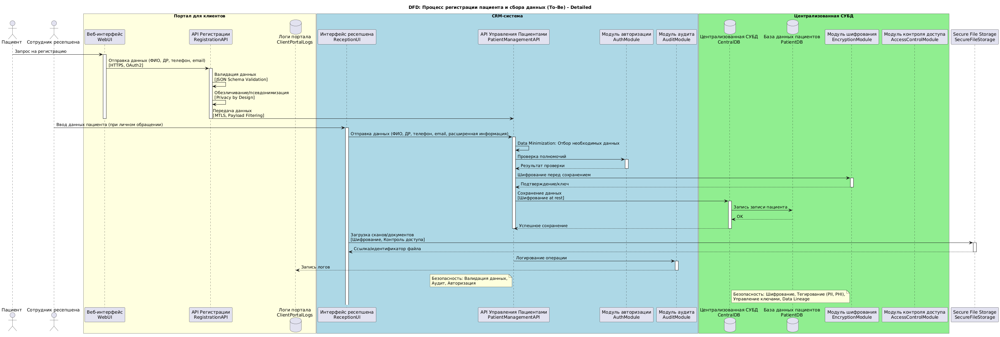
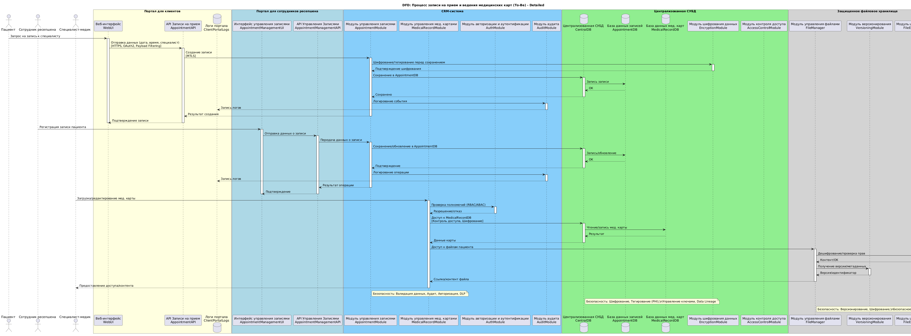
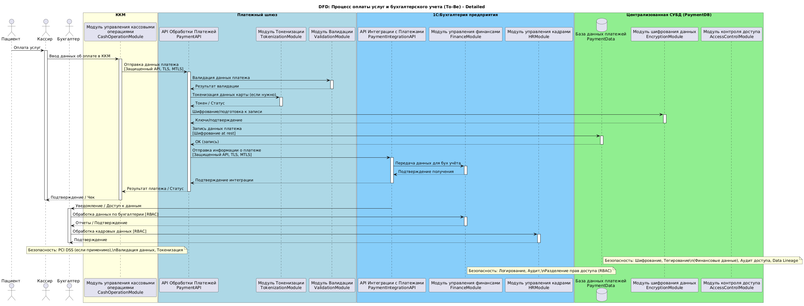
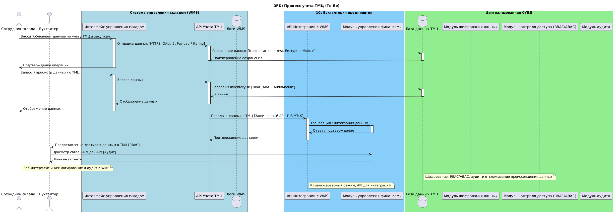

## Задание 1. Анализ безопасности системы

**Цель:** Проанализировать текущее состояние безопасности системы "Медикаменте" (As-Is), выявить риски утечки и неправомерного использования конфиденциальных данных, выявить проблемные зоны, и предложить меры по улучшению защиты, с учетом принципов Privacy by Design, Data Minimization, Data Lineage, требований российского законодательства (152-ФЗ и 323-ФЗ) и архитектурных практик в области безопасности.  

### 1. Выявление конфиденциальных данных, не учтенных во внутренних системах.

Помимо стандартных идентификаторов и медицинских данных, необходимо учитывать:  

**• Персональные данные пациентов (PII):** Ф.И.О., дата рождения, телефон, электронная почта, адрес прописки, место работы/учёбы. Хранятся в Excel-файлах, сканированных документах, "1С:Бухгалтерия", Exchange Mail Server.  
**• Медицинские данные пациентов (Sensitive Health Information):** Хронические заболевания, результаты анализов, заключения специалистов, медицинские карты. Хранятся в файлах различных форматов, Excel-файлах, Exchange Mail Server.  
**• Финансовые данные:** Данные о платежах пациентов, информация о принятии денежных средств, зарплаты сотрудников. Хранятся в «1С:Бухгалтерия предприятия», Excel-файлах, связанных с кассовыми операциями, а также могут проходить через ККМ.  
**• Данные о сотрудниках:** Кадровая информация, зарплаты. Хранятся в «1С:Бухгалтерия предприятия».  
**• Данные о посещении других врачей/медицинских учреждений:** Информация, полученная от пациента.  
**• Расовая и этническая принадлежность:** Может собираться в целях статистики, требует особого контроля.  
**• Информация о сексуальной жизни:** В некоторых случаях может быть собрана, является крайне чувствительной.  
**• Записи телефонных разговоров:** Если ведутся записи телефонных разговоров с пациентами (например, при записи на прием), они также содержат конфиденциальную информацию.  
**• Неучтенные/скрытые метаданные:** Метаданные сканов (exif), резервные копии Excel, временные файлы, кэш браузера, конфигурации "1С" с паролями (файлы), учетные записи ККМ и их логи.  

**Проблемы:** Отсутствие централизованного и структурированного хранения, ручная обработка, отсутствие аудита доступа и изменений, отсутствие шифрования (at rest/in transit), отсутствие контроля версий и управления жизненным циклом данных.  

### 2. Анализ информации о компании.

Компания "Медикаменте" использует преимущественно ручную обработку и хранение конфиденциальных медицинских данных в небезопасных форматах (Excel, сканы на общем диске), имеет небольшой IT-отдел и планирует расширение, что создает значительные риски для безопасности данных и не соответствует законодательству. Использование "1С" в файловом режиме ограничивает масштабируемость и безопасность.  Двойной учет (Excel и 1С) усложняет сверку и повышает риск ошибок.  

### 3. Создание диаграмм потоков данных (Data Flow Diagrams - DFD).  

Для анализа потоков данных в "Медикаменте" создаются диаграммы DFD с использованием PlantUML. Каждая диаграмма представляет отдельный процесс. На диаграммах отображаются:  

**• Источники:** Пациенты, сотрудники (ресепшен, врачи, кассиры, бухгалтеры, склад).  
**• Процессы:** Запись на прием, прием пациента, оплата услуг, проведение анализов, учет ТМЦ, бухгалтерский учет, формирование отчетности.  
**• Хранилища:** Excel-файлы, сканы, базы данных "1С", файловый сервер, папки с данными пациентов.  
**• Потоки:** Передача информации между источниками, процессами и хранилищами.  
**• Внешние субъекты:** Лаборатория, страховые компании.  
**• Меры безопасности:** Шифрование, ролевой доступ (RBAC/ABAC), аудит, токенизация и т.д. отображаются непосредственно на потоках данных.  

####  3.1 DFD: Процесс регистрации пациента и сбора данных (As-Is)

Диаграмма в формате Plant UML: [DFD: Процесс регистрации пациента и сбора данных (As-Is)](dfd_as_is_1.puml)

#### 3.2 DFD: Процесс записи на прием и ведение медицинских карт (As-Is)

Диаграмма в формате Plant UML: [DFD: Процесс записи на прием и ведение медицинских карт (As-Is)](dfd_as_is_2.puml)

#### 3.3 DFD: Процесс оплаты услуг и бухгалтерского учета (As-Is)

Диаграмма в формате Plant UML: [DFD: Процесс оплаты услуг и бухгалтерского учета (As-Is)](dfd_as_is_3.puml)

#### 3.4 DFD: Процесс учета ТМЦ (As-Is)

Диаграмма в формате Plant UML: [DFD: Процесс учета ТМЦ (As-Is)](dfd_as_is_4.puml)

### 4. Аудит мер по обеспечению безопасности данных (As-Is).

Сопоставление текущих процессов с требованиями и практиками:

| Аспект безопасности  | Текущее состояние (As-Is)                            | Соответствие требованиям/практикам (PbD, Data Minimization, Законодательство РФ, CIA) | Проблемы/Риски                                                |
| :------------------- | :--------------------------------------------------------------------------------- | :----------------------------------------------------------------------------------- | :------------------------------------------------------------------------------------------------------------- |
| Конфиденциальность  | Данные хранятся на общем диске (Excel, сканы), без шифрования. Доступ на уровне ОС. | Низкое. Отсутствует PbD. Несоответствие ФЗ-152.                   | Высокий риск несанкционированного доступа, просмотра и утечки данных.                      |
| Целостность     | Ручной ввод данных, двойной учет, отсутствие контроля версий.            | Низкое. Нет механизмов контроля целостности данных, нет аудита изменений.        | Риск ошибок при вводе, потери данных, искажения информации.                          |
| Доступность     | Данные доступны через общие сетевые ресурсы. Файловый режим 1С.          | Среднее. Зависимость от одного физического сервера. Файловый режим 1С имеет ограничения.  | Риск потери доступности при сбое сервера, проблемы с конкурентным доступом в 1С.                |
| Аудит и логирование | Полностью отсутствуют.                               | Отсутствует. Нет возможности отследить действия пользователей.             | Невозможность выявить источник утечки, инцидента; отсутствие ответственности.                 |
| Управление доступом | Доменная аутентификация, без детализации (RBAC/ABAC).               | Низкое. Нет гранулярного контроля доступа к отдельным категориям данных.         | Возможность доступа к данным, которые не нужны для выполнения рабочих обязанностей.               |
| Data Minimization  | Собирается и хранится вся информация, даже расширенные формы.            | Низкое. Данные не минимизируются, нет политики хранения.                | Избыточное хранение данных увеличивает риски утечки и объем работ по их защите.                 |
| Privacy By Design  | Отсутствует. Безопасность не заложена на этапе проектирования.            | Отсутствует.                                      | Сложно внедрить меры безопасности постфактум, это дорого и менее эффективно.                |
| Data Lineage     | Не отслеживается.                                 | Отсутствует.                                      | Нет понимания, откуда данные пришли, куда идут, как обрабатываются.                     |
| Соответствие ФЗ-152 (РФ) | Прямое нарушение требований к хранению и обработке ПДн.              | Низкое.                                       | Репутационные и финансовые риски, штрафы.                                   |

### 5. Список проблемных зон.

**• Отсутствие централизованной, структурированной СУБД.**  
**• Ручная обработка конфиденциальных данных.**  
**• Несоответствие законодательству РФ (152-ФЗ и 323-ФЗ).**  
**• Слабый контроль доступа.**  
**• Отсутствие аудита и логирования действий.**  
**• Отсутствие шифрования (at rest и in transit).**  
**• Проблемы с масштабируемостью.**  
**• Отсутствие интеграций и API.**  
**• Невозможность анализа данных.**  
**• Низкая сопровождаемость и конфигурируемость.**  
**• Отсутствие процессов удаления данных по запросу субъекта.**  
**• Платежи:** Двойной учет, возможное несоблюдение PCI-DSS.  
**• Недостаточная осведомленность сотрудников о требованиях безопасности.**  
**• Недостаточный контроль физического доступа к серверной комнате.**  
**• Недостаточное резервное копирование.**  

### 6. Что можно улучшить.

**Необходимо внедрить:**  

**• Privacy by Design:** Классификация данных, минимизация хранения, согласие и управление доступом.  
**• Централизованную защищенную инфраструктуру:** С полем-уровневым шифрованием и RLS/ABAC.  
**• IAM:** (Контролируемые роли, SSO, MFA).  
**• Data Catalog + мета-тегирование:** (PII/SPI/retention) и DLP.  
**• Сетевую сегментацию:** Отделить серверную зону от офисной сети и от гостевой/интернет.  
**• API Gateway:** (OAuth2, MTLS), фильтрацию полей, rate limiting и аудит.  
**• Безопасную обработку платежей:** Использовать внешние платёжные шлюзы/токенизацию; не хранить PAN/CVV.  
**• SIEM:** (Wazuh/Elastic/Graylog) + мониторинг аномалий.  
**• Шифрование:** At-rest (AES-256), at-transit (TLS1.2+/MTLS), KMS/HSM для ключей.  
**• Процедуры:** Обработка обращений субъектов, процессы удаления и архивации, согласия на обработку.  
**• Проактивную безопасность:** DLP, EDR, регулярные pentest и обучение персонала.  

### 7. Список данных для защиты и способы защиты.

| Данные                                   | Способ защиты                                                                                                                                                    |
| :--------------------------------------- | :-------------------------------------------------------------------------------------------------------------------------------------------------------------- |
| ФИО, ДР, телефон, email, адрес            | TLS in transit; AES-256 at rest; field-level encryption; UI-masking; RBAC/ABAC; псевдонимизация/обезличивание для аналитики и тестирования.                      |
| Медицинские данные                       | Field-level encryption, строгий ABAC/RBAC, журналирование, обезличивание для аналитики.  Токенизация/Маскирование: для отображения части данных. Хранить в пределах РФ. |
| Результаты лабораторий                     | API-интеграция по MTLS + OAuth2; шифрование ID пациентов; псевдонимизация в дата-лейк.                                                                           |
| Платежные данные                           | PCI-DSS compliance; токенизация; TLS; шифрование логов; ограниченный доступ.                                                                                      |
| HR/кадровые данные                         | Отдельная HR-система с RLS, шифрование at-rest, доступ только HR и бухгалтерии.                                                                                   |
| Логи / журналы доступа                      | Централизованный SIEM, шифрованные бэкапы логов, контроль доступа к SIEM.                                                                                         |
| Данные в резервных копиях                 | Шифрование резервных копий. Контроль доступа к хранилищу резервных копий.                                                                                            |

### 8. Механизм тегирования данных.

**• Использовать Data Catalog + метаданные:** (Apache Atlas, Amundsen, Collibra или Postgres + веб-UI).  
**• Структура тега:** {classification: [PUBLIC, PII, SPI], retention_days: N, encryption: [at_rest, field_level], access_policy: [RBAC_role_list or ABAC_policy_id], sensitivity: [low/medium/high], retention_action: [delete/archive], jurisdiction: [RU, EU,...]}  
**• Применение:** Система проверяет теги и применяет трансформации автоматически при публикации данных в API или выгрузке в дата-лейк. DLP блокирует несанкционированный экспорт.  
**• Маскирование/Токенизация:** Автоматическое маскирование данных при отображении для пользователей без необходимых разрешений.  
**• Аудит:** Особое внимание к аудиту доступа к данным с высокими тегами конфиденциальности.  
**• Удаление данных:** Политики автоматического или полуавтоматического удаления данных по истечении срока хранения, основанные на тегах.  
**• Инструменты тегирования:** DLP-системы, Системы классификации данных, Облачные решения (Google Cloud Data Loss Prevention, AWS Macie), Собственные реализации.  

### 9. Список инструментов, способов и мер для обеспечения конфиденциальности данных.

**• Централизованная СУБД:** (Postgres, ClickHouse).  
**• IAM:** Keycloak / FreeIPA / Active Directory + SSO, MFA.  
**• Секрет-менеджмент и KMS:** HashiCorp Vault / AWS KMS / HSM.  
**• DB & field encryption:** PostgreSQL + pgcrypto / клиентское шифрование.  
**• RBAC/RLS:** Postgres Row Level Security / приложение с ABAC.  
**• API Gateway:** Kong/Tyk/Istio (mTLS, OAuth2, rate limiting, field filtering).  
**• SIEM:** ELK stack (Elastic), Wazuh, Graylog + Alertmanager/Prometheus.  
**• DLP:** Symantec DLP / Forcepoint / open source правила.  
**• EDR/Anti-malware:** CrowdStrike/OSQuery/Wazuh.  
**• Backup/DR:** Зашифрованные off-site бэкапы, тестирование восстановления.  
**• Системы DLP (Data Loss Prevention):** Для предотвращения утечки конфиденциальных данных за пределы контролируемой среды.  
**• Безопасность API:** Строгая валидация входящих данных, авторизация на уровне API-контрактов, защита от инъекций и других атак.  

### 10. Доработка диаграмм DFD (To-Be, с учетом безопасности).  

#### 10.1 DFD: Процесс регистрации пациента и сбора данных (To-Be, с учетом безопасности)  

Диаграмма в формате Plant UML: [DFD: Процесс регистрации пациента и сбора данных (To-Be, с учетом безопасности)](dfd_to_be_1.puml)  

#### 10.2 DFD: Процесс записи на прием и ведение медицинских карт (To-Be, с учетом безопасности)  

Диаграмма в формате Plant UML: [DFD: Процесс записи на прием и ведение медицинских карт (To-Be, с учетом безопасности)](dfd_to_be_2.puml)  

#### 10.3 DFD: Процесс оплаты услуг и бухгалтерского учета (To-Be, с учетом безопасности)  

Диаграмма в формате Plant UML: [DFD: Процесс оплаты услуг и бухгалтерского учета (To-Be, с учетом безопасности)](dfd_to_be_3.puml)  

#### 10.4 DFD: Процесс учета ТМЦ (To-Be, с учетом безопасности)  

Диаграмма в формате Plant UML: [DFD: Процесс учета ТМЦ (To-Be)](dfd_to_be_4.puml)  

### Заключение

Это решение обеспечивает комплексный анализ безопасности системы "Медикаменте", выявляет проблемные зоны, предлагает конкретные меры по защите данных и соответствует требованиям российского законодательства и лучшим практикам в области безопасности. Особое внимание уделено внедрению принципов Privacy by Design на всех этапах проектирования и разработки новых систем.  Также,  особое внимание уделено обучению сотрудников по вопросам безопасности данных, политик конфиденциальности и ответственности и  проведению регулярных аудитов и тестирований: Проведение пентестов и аудитов безопасности для выявления уязвимостей.  