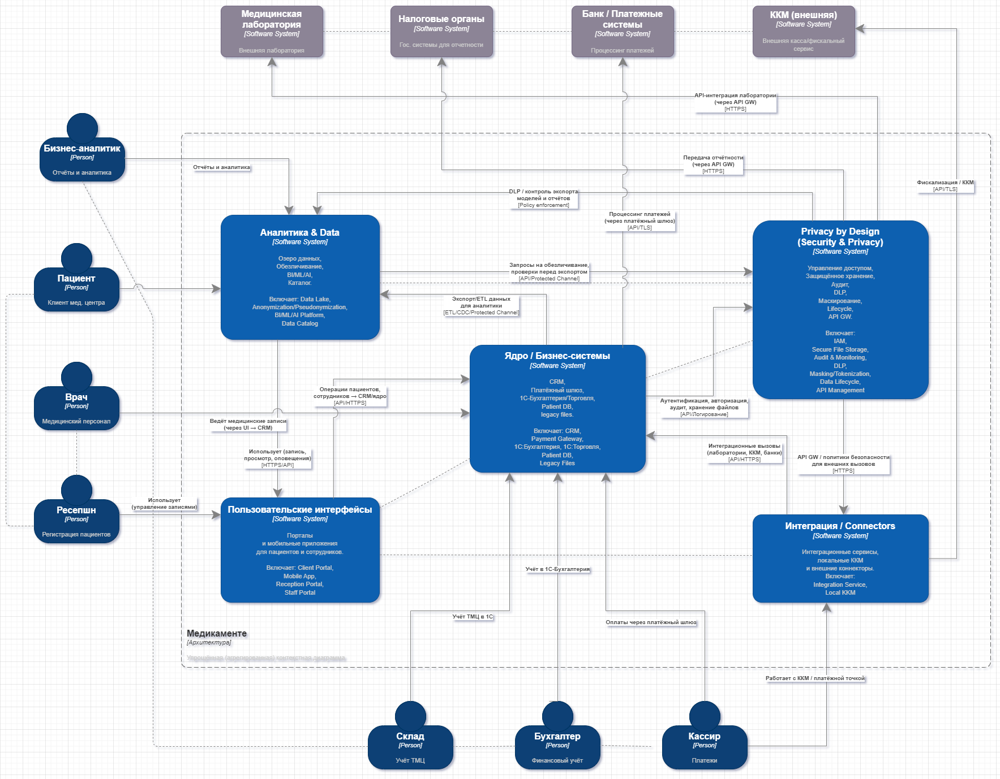
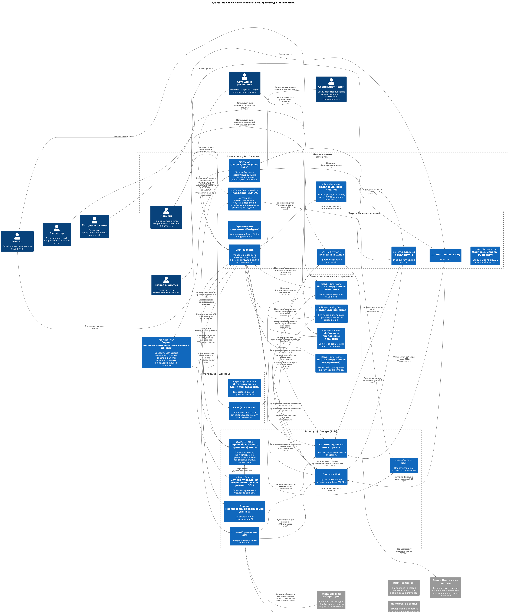

## Задание 2. Проектирование решения  

**Цель:** Спроектировать целевую архитектуру системы "Медикаменте" с учетом принципов Privacy by Design, предложив новые блоки и механизмы для защиты конфиденциальных данных и предупреждения рисков, связанных с конфиденциальностью, обеспечивая соответствие 152-ФЗ и GDPR, и предоставляя безопасные аналитические возможности.  

### Анализ состояния As-Is (кратко):  

• Ручная обработка данных.  
• Централизованное хранение данных без должного разграничения прав доступа.  
• Отсутствие системы аудита.  
• Файловый режим работы "1С".  
• Отсутствие шифрования.  

Это создает значительные риски для конфиденциальности данных.  

### Принципы Privacy by Design, применяемые в проекте:  

**1. Превентивный, а не реактивный; проактивный, а не корректирующий:** Предупреждение рисков на этапе проектирования, а не исправление последствий.  
**2. Privacy as the Default Setting:** Максимальная конфиденциальность по умолчанию. Доступ к данным должен быть ограничен минимально необходимым кругом лиц и в соответствии с их ролями.  
**3. Privacy Embedded into Design:** Интеграция мер защиты конфиденциальности во все этапы разработки и функционирования системы.  
**4. Full Functionality — Positive-Sum, not Zero-Sum:** Конфиденциальность не должна ограничивать функциональность системы, а наоборот, должна ее усиливать.  
**5. End-to-End Security — Full Lifecycle Protection:** Обеспечение безопасности данных на протяжении всего жизненного цикла.  
**6. Visibility and Transparency — Keep it Open:** Прозрачность процессов обработки данных и возможность для пользователей контролировать свои данные.  
**7. Respect for User Privacy — Keep it User-Centric:** Уважение прав пользователей на конфиденциальность и предоставление им возможности управлять своими данными.  

### Контекстная (C4) диаграмма целевой архитектуры «Медикаменте» 

Контекстная (C4) диаграмма целевой архитектуры «Медикаменте» с новыми блоками по Privacy‑by‑Design и безопасной аналитике:  

  
[Открыть / скачать диаграмму (Drawio)](C4_Context.drawio)  

(Также приводится **комплексная (полная, детализированная)** контекстная (C4) диаграмма целевой архитектуры «Медикаменте» с новыми блоками по Privacy‑by‑Design и безопасной аналитике)  

  
[Открыть / скачать диаграмму (PlantUML)](C4_Context_Complex.puml)  

#### Описание новых блоков и их вклад в Privacy by Design:  

**• API Gateway:** Фильтрует данные по контрактам, скрывая SPI по умолчанию; обеспечивает безопасную интеграцию с внешними системами.  
**• IAM/SSO/MFA:** Централизованное управление доступом, MFA для привилегированных ролей, гранулярный контроль доступа (RBAC/ABAC).  
**• KMS/Vault (Secure File Storage):** Шифрование данных в Secure File Storage и управление ключами, разделение ответственности.  
**• DLP:** Предотвращение утечек PII/SPI через email, web, выгрузки; политики контроля экспорта.  
**• SIEM + Audit Service:** Мониторинг, обнаружение аномалий и аудит доступа к данным; полный трейс доступа к SPI.  
**• Consent Management + Data Catalog:** (Удалено, функциональность интегрирована в CRM). Управление согласием (интегрировано в CRM). Data Catalog: Каталогизация данных, метаданные, классификация (PII/SPI/public), retention, jurisdiction.  
**• Privacy Module:** Обезличивание и псевдонимизация данных для аналитики; применение различных методов (обобщение, шумоподавление, агрегация, токенизация).  
**• Data Lake:** Изолированное хранилище для аналитических данных; разделение операционной и аналитической зон.  
**• ML Platform:** Обучение моделей на обезличенных данных с контролем доступа; защита моделей от восстановления персональных данных.  
**• Data Lifecycle Service (DCL):** Автоматическое применение политик хранения и удаления данных; соблюдение права на забвение.  

#### Слой для аналитической работы с данными с учетом Privacy by Design:  

**1. Данные из CRM, 1С:** Данные из операционных систем передаются в Data Lake (ETL/CDC).  
**2. Data Lake:** Хранилище сырых и полуструктурированных данных. Доступ ограничен (IAM). Данные зашифрованы (at rest).  
**3. Privacy Module:** Применяются политики обезличивания и псевдонимизации (Data Catalog). Метаданные записываются в Data Catalog.  
**4. BI/ML/AI Platform:** Аналитики и ML-инженеры работают только с обезличенными данными.  
**5. Результаты:** Результаты аналитики представляются в виде отчетов и дашбордов, не содержащих SPI.  

#### Механизмы для предупреждения рисков, связанных с конфиденциальностью (основанные на Privacy by Design):  

**• Минимизация данных:** Сбор только необходимого объема данных.  
**• Ограничение доступа (RBAC/ABAC):** Доступ только для необходимых сотрудников.  
**• Шифрование (at rest and in transit):** Защита данных при хранении и передаче.  
**• Аудит:** Регистрация всех действий с конфиденциальными данными.  
**• Контроль со стороны пациента:** Возможность просмотра, изменения, удаления данных (через реализацию в портале и CRM).  
**• Прозрачность:** Обеспечение прозрачности процессов обработки данных.  
**• Обучение:** Обучение сотрудников вопросам безопасности данных.  
**• Тестирование:** Регулярное тестирование системы на уязвимости.  
**• Оценка рисков:** Периодическая оценка рисков конфиденциальности.  
**• API Gateway:** Применение политик фильтрации данных на уровне API.  
**• Data Catalog:** Управление метаданными и тегирование для автоматизации политик.  
**• Data Lineage:** Отслеживание пути данных от источника до аналитики.  
**• DLP:** Контроль попыток выгрузки/эксфильтрации данных.

#### Как это предупреждает риски до реализации изменений:  

•  Архитектура реализует принцип "deny by default" через API Gateway, Data Catalog и интегрированное в CRM управление согласием.  
•  KMS и шифрование защищают данные "на диске".  
•  Privacy Module и Data Catalog автоматизируют применение политик обезличивания перед аналитикой.  
•  DLP, SIEM и Audit Service обеспечивают раннее обнаружение инцидентов и трассировку доступа к SPI.  
•  IAM/ABAC и RLS препятствуют несанкционированному доступу.  

### Рекомендации по следующему шагу (внедрение):  

1. Описать API-контракты с явно скрытыми SPI полями и внедрить через API Gateway.  
2. Инвентаризировать поля в legacy_files и 1С, загрузить в Data Catalog и проставить теги.  
3. Реализовать PoC Privacy Module и миграцию данных в Data Lake.  
4. Настроить IAM + MFA и перевести все доступы на SSO.  
5. Включить SIEM и DLP для мониторинга и блокировок.  
6. Провести обучение сотрудников основам Privacy by Design и безопасной работе с данными.  
7. Реализовать интеграцию управления согласием непосредственно в CRM-систему.  

### Оценка решения с учетом требований To-Be:  

Предложенное решение соответствует требованиям To-Be и обеспечивает высокий уровень защиты конфиденциальных данных и соответствие законодательству за счет внедрения новых блоков, механизмов и принципов Privacy by Design, а также предоставление безопасных аналитических возможностей. “Медикаменте” сможет безопасно использовать данные для улучшения качества медицинских услуг, соблюдая права пациентов на конфиденциальность, прозрачность и контроль над своими данными.  