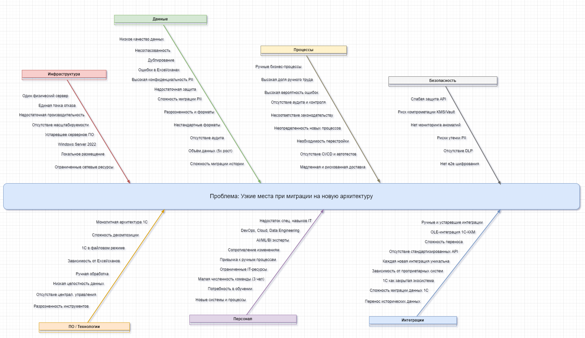

## Задание 4. Оценка узких мест при миграции

**Цель:** Выявить потенциальные узкие места и риски, которые могут негативно повлиять на работоспособность нового решения при миграции устаревшей монолитной системы компании «Медикаменте» на современную архитектуру (предположительно микросервисную). Предложить меры по их устранению и оценить их приоритетность, учитывая принципы Privacy by Design, Data Lake, API Gateway, KMS/Vault, а также требования законодательства РФ.

### 1. Анализ ситуации (As-Is и To-Be)  

#### Текущая система (As-Is):  

  • **Хранение данных:** В основном Excel-файлы, JPG и PDF-сканы, хранящиеся на общем диске. Медицинские карты, журналы приёма, учёт пациентов и платежей — всё в файлах.  
  • **Учётные системы:** «1С:Бухгалтерия предприятия» и «1С:Торговля и склад» работают в файловом режиме. ККМ интегрированы через TCP/IP и OLE-компоненты 1С.  
  • **Инфраструктура:** Все IT-продукты развёрнуты на одном физическом сервере (Microsoft Windows Server 2022) в офисе компании. На сервере также настроены Active Directory, DNS, DHCP, LDAP, файловый сервер, Exchange Mail Server.  
  • **Управление данными:** Отсутствует аудит действий с данными, внутренние потоки данных не контролируются, доступ к данным ограничен лишь доменной аутентификацией.  
  • **IT-отдел:** Состоит из 3 человек с определённым стеком технологий, но без явной специализации по облачным решениям, масштабированию данных или DevOps.  

#### Цели миграции (To-Be):  

  • **Автоматизация:** Полная автоматизация всех процессов (запись пациентов, учёт, медицинские карты).  
  • **Масштабируемость:** Поддержка пятикратного роста объёма данных и расширения команды, открытие новых филиалов.  
  • **Безопасность данных (Privacy by Design):** Усиление защиты конфиденциальных медицинских данных (PII), соответствие законодательству РФ, предотвращение утечек, реализация RBAC/ABAC, аудит доступа и мониторинг аномалий.  
  • **Новые сервисы:** Интеграция с лабораторией анализов через API, разработка BI/ML/AI-сервисов на базе озера данных, создание клиентского и рецепционного портала, платёжного шлюза, CRM, мобильного приложения.  
  • **Миграция:** Переход от ручного учёта и разрозненных файлов к единой системе хранения и управления данными.  

#### Ключевые процессы и компоненты, затрагиваемые миграцией:  

  • **Процессы:** Приём и запись пациентов, ведение медицинских карт, обработка платежей, складской учёт, HR-процессы, бизнес-аналитика. Все эти процессы будут трансформироваться из ручных/полуавтоматических в полностью автоматизированные.  
  • **Компоненты:**  
    * **Данные:** Пациентские данные (Ф.И.О., дата рождения, телефон, медицинские записи, анализы), финансовые данные (платежи, зарплаты), ТМЦ.  
    * **Хранилища:** Excel-файлы, сканы, файловая система, 1С-базы.  
    * **Бизнес-логика:** Логика работы 1С, правила ручной обработки данных.  
    * **Коммуникационные каналы:** Локальная сеть, OLE-интеграции, будущие API.  
    * **Серверное оборудование:** Единственный физический сервер.  
    * **ПО:** 1С, Microsoft Windows Server 2022, Active Directory, DNS, DHCP, LDAP, файловый сервер, Exchange Mail Server, ККМ.  
    * **Персонал:** Медицинские специалисты, ресепшен, кассиры, бухгалтерия, склад, IT-отдел.  

### 2. Диаграмма Исикавы (Рыбья кость) для выявления узких мест при миграции

[Открыть / скачать диаграмму (Ishikawa.drawio)](Ishikawa.drawio)

### 3. Описание категорий проблем (Текстовое представление диаграммы)

*   **Инфраструктура:**
    *   Один физический сервер (единая точка отказа, недостаточная производительность, отсутствие масштабируемости).
    *   Устаревшее серверное ПО / Локальное размещение (Windows Server 2022, ограниченная гибкость).
    *   Ограниченные сетевые ресурсы (не выдерживают возросший трафик).
*   **Программное обеспечение:**
    *   Монолитная архитектура 1С (сложность декомпозиции, устаревший файловый режим).
    *   Зависимость от Excel и сканов (ручная обработка, низкая целостность данных).
    *   Отсутствие централизованного управления данными (разрозненность инструментов).
*   **Данные:**
    *   Низкое качество данных (несогласованность, дублирование, ошибки).
    *   Высокая конфиденциальность PII (недостаточная защита, сложность миграции).
    *   Разрозненность и форматы (нестандартные форматы, отсутствие аудита).
    *   Объём данных (пятикратный рост, сложность миграции истории).
*   **Персонал:**
    *   Недостаток специализированных навыков IT (DevOps, Cloud, Data Engineering, AI/ML/BI).
    *   Сопротивление изменениям со стороны сотрудников (привычка к ручным процессам).
    *   Ограниченные IT-ресурсы (малая численность команды, потребность в обучении).
*   **Процессы:**
    *   Ручные бизнес-процессы (высокая доля ручного труда, вероятность ошибок).
    *   Отсутствие аудита и контроля (несоответствие законодательству).
    *   Неопределенность новых процессов (необходимость перестройки).
    *   Отсутствие CI/CD и автоматизированного тестирования (медленная и рискованная доставка).
*   **Интеграции:**
    *   Ручные и устаревшие интеграции (OLE-интеграция 1С-ККМ, сложность переноса).
    *   Отсутствие стандартизированных API (каждая новая интеграция уникальна).
    *   Зависимость от проприетарных систем (1С как закрытая экосистема, сложность миграции данных).
*   **Безопасность:**
    *   Отсутствие DLP (риски утечки PII).
    *   Слабая защита API (риск компрометации данных).
    *   Риск компрометации ключей KMS/Vault (недостаточное управление ключами).
    *   Отсутствие e2e шифрования (нет защиты данных на всем пути).
    *   Нет мониторинга аномалий (невозможно быстро обнаружить атаки).

### 4. Анализ и обоснование узких мест

*   **Инфраструктура:** Миграция данных I/O и сеть-интенсивна. Недостаток ресурсов блокирует ETL/CDC. Один сервер - единая точка отказа.
*   **KMS/Vault:**  Дешифрование в runtime создает высокую нагрузку и задержки. Неправильное управление ключами - риск компрометации данных.
*   **API Gateway:** Неправильный дизайн микросервисной архитектуры ведет к лавинообразной деградации.
*   **Legacy зависимости:** Затрудняют и удлиняют миграцию.
*   **Человеческий фактор:** Отсутствие обученной команды увеличивает вероятность ошибок.
*   **Безопасность:** Отсутствие DLP, аудита и мониторинга создает риски утечек данных и компрометации системы.

### 5. Предложение рекомендаций и приоритезация

| Проблема                                                                                               | Рекомендации                                                                                                                                                                                       | Приоритет |
| :----------------------------------------------------------------------------------------------------- | :------------------------------------------------------------------------------------------------------------------------------------------------------------------------------------------------- | :------- |
| **Инфраструктура:** Недостаточная производительность серверов, сети, дисков                              | 1. Capacity Planning и нагрузочное тестирование.  2. Миграция в облако (Yandex Cloud, VK Cloud)  3. Сегментация сети.                                                                                                     | Высокий  |
| **Данные:** Низкое качество, большой объем, сложная структура                                            | 1. Профилирование и очистка данных (Data Cleansing).   2. Оптимизация структуры данных.   3. Поэтапный перенос (CDC, Strangler Fig Pattern). 4. Автоматизация переноса.                                                               | Высокий  |
| **Программное обеспечение:** Несовместимость, ошибки в коде, сложность, недостаточное тестирование           | 1. Микросервисная архитектура.   2. Хорошо документированный API.   3. Тщательное тестирование (e2e, интеграционное, нагрузочное, security testing).   4. Оптимизация кода.   5. Инструменты мониторинга (tracing, metrics, logging).       | Высокий  |
| **Интеграция:** Несовместимость API, безопасность, производительность                                | 1. Стандартизированные REST API.   2. Механизмы безопасности API (аутентификация, авторизация, шифрование TLS/mTLS).   3. Оптимизация производительности API.   4. API Gateway с rate limiting и circuit breakers.                 | Высокий  |
| **Безопасность:** Отсутствие DLP, политик доступа, отсутствие e2e шифрования                           | 1. Внедрение DLP-системы.   2. Автоматизация политик доступа (RBAC/ABAC).   3. Внедрение e2e шифрования PII-данных.   4. SIEM-система для мониторинга аномалий.                                         | Высокий  |
| **Персонал и процессы:** Недостаточная квалификация, опыт, нехватка персонала                             | 1. Усиление IT-команды (DevOps, Cloud, Data Engineering).   2. Обучение персонала (DevOps, Kubernetes, Vault, Kafka).   3. Разработка runbooks/rollback планов.   4. Управление изменениями (коммуникация, снижение сопротивления).                                    | Средний  |
| **KMS/Vault:** Высокая нагрузка на дешифрование, риск компрометации ключей                              | 1. Envelope encryption.   2. Кэширование Data Keys (кратковременное).   3. Batch-шифрование при ETL.   4. High Availability KMS/HSM.   5. Строгий контроль доступа к Vault.                                             | Высокий  |
| **Legacy 1С/Excel:** Сложности с преобразованием данных                                                     | 1. Поэтапная миграция 1С в клиент-сервер или API-интеграция.   2. Data Lake для аналитики и отчетности.                                                                                                           | Низкий  |
| **API Gateway:** Перегрузка и риск деградации                                                         | 1. Масштабирование API Gateway (autoscaling, rate limiting, circuit breakers).   2. Нагрузочное тестирование.   3. Payload validation на шлюзе.                                                          | Средний  |
| **Отсутствие мониторинга:** Сложность поиска узких мест                                                    | 1. Внедрение observability (Jaeger/Zipkin, Prometheus/Grafana, ELK).   2. Настройка SLO/SLI.   3. Автоматические тесты целостности данных.                                                                | Низкий  |
| **Несоответствие законодательству РФ:** Хранение PII без защиты, отсутствие аудита                             | 1. Внедрение средств защиты PII (шифрование, маскирование).   2. Настройка аудита доступа к PII.   3. Соблюдение требований 152-ФЗ.                                                                 | Высокий  |

### 6. План мер (Roadmap)

*   **Фаза 0 — Подготовка (1–2 недели):**
    *   Инвентаризация сервисов, таблиц и legacy-файлов.
    *   Capacity planning: бенчмаркинг сети и дисков.
    *   Выбор облачной платформы и технологий.
    *   Подготовка runbooks и критериев отката.
*   **Фаза 1 — Поиск узких мест и PoC (2–6 недель):**
    *   PoC CDC (Debezium) и PoC envelope encryption с кэшем ключей.
    *   Нагрузочные тесты ETL, API Gateway и KMS при целевой нагрузке.
    *   Настройка мониторинга (Prometheus/Grafana, tracing) для PoC.
    *   Оценка рисков безопасности и разработка плана защиты PII.
*   **Фаза 2 — Миграция данных и сервисов (пошагово, 1–6 мес):**
    *   Миграция: bulk export → предварительная загрузка → CDC синхронизация → cutover по доменам (Strangler pattern).
    *   Обеспечить параллельные воркеры, партиционирование и индексацию до cutover.
    *   Использовать асинхронные очереди для тяжёлых операций (импорт обработок, обработка сканов).
    *   Внедрение политик безопасности, шифрования и аудита.
*   **Фаза 3 — Пост-миграционное тестирование и оптимизация (1–3 мес):**
    *   Полная валидация целостности данных, нагрузочные тесты под реальным трафиком, security testing.
    *   Оптимизация индексов и кешей.
    *   Рефакторинг «горячих» точек, доработка API Gateway конфигураций.
    *   Обучение персонала и перевод процедур на новые процессы.
    *   Аудит соответствия требованиям законодательства РФ (152-ФЗ).

### 7. Контроль внедрения (Метрики и сигналы тревоги)

*   Время cutover для домена (< N минут).
*   RTO / RPO показатели.
*   P95 / P99 latency на API Gateway и endpoint.
*   Количество ошибок 5xx после cutover.
*   Количество обращений к Vault per second и их latency.
*   Скорость CDC lag (seconds).
*   Количество неускорившихся задач ETL.
*   Количество инцидентов безопасности, связанных с PII.
*   Соответствие требованиям законодательства РФ (аудит, шифрование, управление доступом).

### 8. Приоритетизация (резюме)

*   **Срочно (High):** Capacity planning и нагрузочное тестирование; PoC CDC; runbooks; TLS и базовый мониторинг; кэширование шифровальных ключей; аудит и защита PII; выбор облачной платформы.
*   **Средне (Medium):** Масштабирование API Gateway; оптимизация ETL; data quality tools; усиление IT-команды и обучение; внедрение CI/CD.
*   **По плану (Low):** Полная миграция 1С; перенос аналитики в Data Lake; постоянная оптимизация и рефакторинг сервисов.

### Заключение

Миграция «Медикаменте» на современную архитектуру — это сложный, но необходимый шаг для обеспечения масштабируемости, безопасности и развития бизнеса. Выявленные узкие места касаются всех аспектов деятельности компании: от устаревшей инфраструктуры и разрозненных данных до ограниченных ресурсов IT-отдела и ручных бизнес-процессов.

Успех проекта будет зависеть от комплексного подхода к решению этих проблем:   

1. Приоритезация безопасности данных с самого начала (Privacy by Design).   
2. Детальное планирование миграции с учётом поэтапного перехода и минимизации рисков (Strangler Fig Pattern).   
3. Инвестиции в современные технологии (облако, микросервисы, озеро данных, KMS/Vault).   
4. Усиление IT-команды и обучение всего персонала.   
5. Переосмысление и автоматизация бизнес-процессов.   
6. Соблюдение требований законодательства РФ (152-ФЗ).  

Внедрение предложенных рекомендаций поможет «Медикаменте» не только избежать большинства потенциальных проблем при миграции, но и заложить прочный фундамент для дальнейшего инновационного развития своих услуг и соответствия нормативным требованиям.